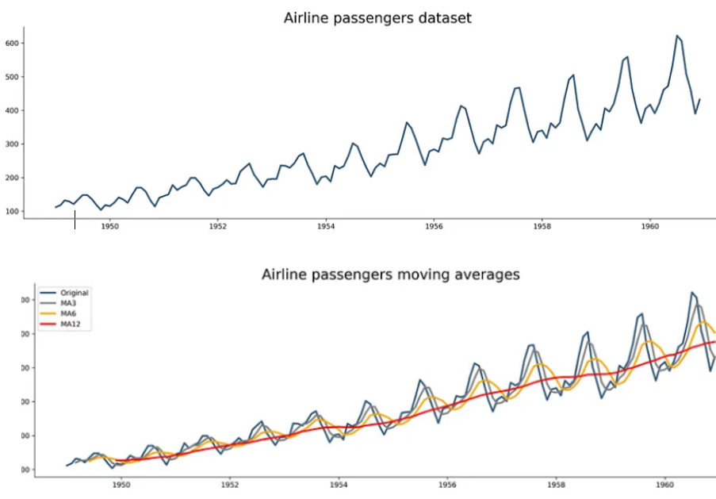

### Stationary
For a time series to be considered stationary, these conditions should be met:  
-Constant mean  
-Constant Variance  
-Constant autocorrelation structure (current value being dependent on past value)  
-No period component (no trend or seasonality) 

 This means that the statistical properties of the series do not change with time or depend on the time period. Stationarity is desirable for many forecasting methods, such as ARIMA, because it makes the models simpler and more reliable. Most stationary data will be roughly horizontal and will have no predictable pattern in the long term.

### Parameter Overview
- __p__ and seasonal __P__: [PACF Plot] indicate number of autoregressive terms (__lags__ of the stationarized series)
- __d__ and seasonal __D__: [reducing trend/ADF Test] indicate __differencing__ that must be done to stationarize series. Typical range [0,1,2]
- __q__ and seasonal __Q__: [ACF Plot] indicate number of __moving average__ terms (lags of the forecast errors)
- __s__: [seasonal period] indicates __seasonal__ length in the data

##### Differencing:  x_t2 - x_t1
Differencing is a technique to transform a non-stationary time series into a stationary one. It involves subtracting the current value of the series from the previous one, or from a lagged value. For example, if y_t is the value of the series at time t, then the first difference is y_t - y_(t-1), and the second difference is (y_t - y_(t-1)) - (y_(t-1) - y_(t-2)). 

It helps stabilize the mean of a time series by removing change in the level of the time series and therefore eliminating/reducing trend and seasonality, making it more stationary. The order of differencing is the number of times the series is differenced to achieve stationarity. Choosing the right order of differencing is important, because too much or too little differencing can affect the accuracy and validity of the forecasts. The typical range of d and D is [0,1,2] because second order differencing (d=2) is typically enough to make a series stationary in most cases. If the time series does not reach stationarity by econd order differencing, the data quality should be considered.

For example, if you want to measure the milage on a trip day to day, the mpd may greatly vary. But the difference in miles between each day is less likely to have spikes or have as much variability, and even more so between the difference in differnce of miles per day. So differencing works by dampening the extreme values of a dataset.

The effect of differencing. You can see that after first order differencing, the time series is significantly more stationary than the original and the mean and variance are approximately consistent over the years. 

[Manual Determination by ACF Plots]  
If collectively the autocorrelations, or the data point of each lag (in the horizontal axis), are positive for several consecutive lags, more differencing might be needed. Conversely, if more data points are negative, the series is over-differenced.

If all the autocorrelation values are in the blue section, then the data is more or less stationary.

[Manual Determination by ADF Test]  
An Augmented Dickey-fuller test can be used to test stationary.  

_Null Hypothesis:_ Not Stationary  
_Alternative Hypothesis:_ Stationary  
A low p-value from the test indicates that the series is likely to be stationary.

[Determination by AIC]
The Akaike Information Criterion (AIC) or the Bayesian Information Criterion (BIC) can be used to compare different models with different orders of differencing and select the one with the lowest value.

##### Autocorrelation
The degree of similarity between changes in a successive time intervals.  
How Correlated is the time series with itself (all past points)?

“q” can be estimated by looking at the number of total lags crossing the threshold

In the graph, the blue section indicates where the lags are no longer significant. You want to select any lags outside of this blue area, or the lag that has the highest significance

##### Partial Autocorrelation
How correlated is one time series point with the previous time series point or previous lag period (only the preveeding point)? 

P can be determined based on the most significant lag in the partial autocorrelation plot. Make sure to plot the PACF plot based off of the order of differencing chosen. (using the data AFTER differencing if differencing is taken place)

In the graph, the blue section indicates where the lags are no longer significant. You want to select any  lags outisde of this region, or the lag that has the highest significance

##### Moving Average
Moving averages helps by smoothing out the volatility of constantly changing data, therefore reducing trends or seasonality. Fluctuations are reduced. 

