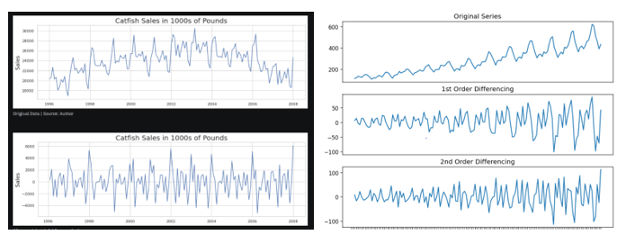

### Stationary
When the properties do not depend on the time/point of the series at which the series is observed.  
For a time series to be considered stationary, these conditions should be met:  
-Constant mean  
-Constant Variance  
-Constant autocorrelation structure (current value being dependent on past value)  
-No period component (no trend or seasonality) 

Most stationary data will be roughly horizontal and will have no predictable pattern in the long term.

### Parameter Overview
- __p__ and seasonal __P__: [PACF Plot] indicate number of autoregressive terms (__lags__ of the stationarized series)
- __d__ and seasonal __D__: [reducing trend/ADF Test] indicate __differencing__ that must be done to stationarize series. Typical range [0,1,2]
- __q__ and seasonal __Q__: [ACF Plot] indicate number of __moving average__ terms (lags of the forecast errors)
- __s__: [seasonal period] indicates __seasonal__ length in the data

##### Differencing:  x_t2 - x_t1
Subtracting the current value of the series from the previous one for from a lagged value. Computing the change between consecutive observations.

It helps stabilize the mean of a time series by removing change in the level of the time series and therefore eliminating/reducing trend and seasonality. The typical tange of d and D is [0,1,2] because second order differencing (d=2) is typically enough to make a series stationary in most cases. If the time series does not reach stationarity by econd order differencing, the data quality should be considered.

The effect of differencing. You can see that after first order differencing, the time series is significantly more stationary than the original and the mean and variance are approximately consistent over the years. 

*Determination by ACF Plots*  
If collectively the autocorrelations, or the data point of each lag (in the horizontal axis), are positive for several consecutive lags, more differencing might be needed. Conversely, if more data points are negative, the series is over-differenced.

If all the autocorrelation values are in the blue section, then the data is more or less stationary.

_Determination by ADF Test_  
An Augmented Dickey-fuller test can be used to test stationary.  

__NUll Hypothesis:__ Not Stationary  
__Alternative Hypothesis:__ Stationary
 

##### Autocorrelation
The degree of similarity between changes in a successive time intervals.  
How Correlated is the time series with itself (all past points)?

“q” can be estimated by looking at the number of total lags crossing the threshold

##### Partial Autocorrelation
How correlated is one time series point with the previous time series point or previous lag period (only the preveeding point)? 

P can be determined based on the most significant lag in the partial autocorrelation plot. Make sure to plot the PACF plot based off of the order of differencing chosen. (using the data AFTER differencing if differencing is taken place)
